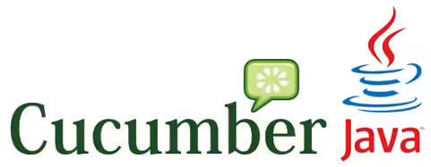

## 📌 Trello`s REST API module testing
   
### [Trello is a visual work management and project organization tool that uses boards, lists, and cards to help teams manage tasks, workflows, and projects.](https://trello.com/tour)

### 🔍 This project aims to test main features of webApp by using documented [REST API](https://developer.atlassian.com/cloud/trello/rest/api). It includes tests for creating, retrieving, updating, and deleting such application resources as: boards, lists, cards, checklist etc., programmatically.

### 📌 The test plan can be viewed [here](https://docs.google.com/document/d/1x4l6HlMD3fGdF0gO151KrflUJz3g_FPxP1uYh8xTLJg/edit?usp=sharing)


---


## 🛠️ stack

<p align="center">
  <a href="https://www.jetbrains.com/idea/" rel="nofollow"></a>
  <a href="https://www.java.com/" rel="nofollow"></a>
  <a href="https://rest-assured.io/" rel="nofollow"></a>
  <a href="https://cucumber.io/" rel="nofollow"></a>
  <a href="https://www.docker.com/" rel="nofollow"></a>
  <a href="https://maven.apache.org/" rel="nofollow"></a>
  <a href="https://testng.org/" rel="nofollow"></a>
  <a href="https://allurereport.org/" rel="nofollow"></a>
  <a href="https://github.com/" rel="nofollow"></a>
  <a href="https://github.com/features/actions" rel="nofollow"></a>
</p>

--- 

### 🎓 Project explanation and main idea:
#### The whole framework divided on 2 parts, that might be run independently or altogether. 
##### 🎇 first consist of tests that implement SOM (Service Object Model) testing pattern with use of TestNG, Rest assured, Allure and all the main features of AUT are being independently separated in a tested classes. In other words, one tested class represents one feature. 
#### 🎇 second is done with the help of Cucumber, and represents logical scenarios of possible use the features of a Trello.
###### <font color="purple"> More details you can find in ReadME directory of a project structure.</font>   
## To run the project in a preferred way, click any of double green arrow below.
#### ❗ Attention: since for that project <ins>was used free plan</ins> of The Trello application, the amount of workspace command runs per month should not exceed 250, otherwise it is not possible to reproduce any of testing activities of that project. 

###

#### Run only Rest assured + TestNG part of the framework
```bash
mvn clean test -Dsuite=restAssured/AllAPIModuleTests
```
---
#### Run only Cucumber part of the framework
```bash
mvn clean test -Dsuite=cucumberRunners/AllCucumberScenarios
```
---
#### Run all tests in parallel mode.
```bash
mvn clean test -Dsuite=AllProjectRunInParallel
```
---
#### Run all tests one by one
```bash
mvn clean test -Dsuite=AllProjectRun
```
--- 
#### Run regress testing with Rest assured + TestNG part of the framework
```bash
mvn clean test -Dsuite=restAssured/AllAPIModuleTests
```

---
#### Run smoke testing with cucumber
```bash
mvn clean test -Dsuite=cucumberRunners/SmokeTest
```
---
#### Run E2E testing with Cucumber that include: basic setup, as, create a board (with specific name), rename the default lists, create additional list, create a few cards.
```bash
mvn clean test -Dsuite=cucumberRunners/EndToEndBasicSetUp
```
---
#### Run E2E testing with Cucumber that include: customer environment, as, create a board without lists on it, create 3-5 lists, create 3-5 cards on a first list.
```bash
mvn clean test -Dsuite=cucumberRunners/EndToEndCustomerEnvironment
```
--- 
## Module testing with testNG and Rest assured that include and separately tests following features:
### board
```bash
mvn clean test -Dsuite=restAssured/BoardAPITest
```
--- 
### actions
```bash
mvn clean test -Dsuite=restAssured/ActionsAPITest
```
--- 
### cards
```bash
mvn clean test -Dsuite=restAssured/CardsAPITest
```
---
### checklists
```bash
mvn clean test -Dsuite=restAssured/ChecklistsAPITest
```
---
### labels
```bash
mvn clean test -Dsuite=restAssured/LabelesAPITest
```
---
### lists
```bash
mvn clean test -Dsuite=restAssured/ListsAPITest
```
---
### members
```bash
mvn clean test -Dsuite=restAssured/MembersAPITest
```

---
## Build Docker image with name 'trello_cucumber_image'. 
#### ❗ <font color="red"> Make sure to turn on docker engine </font>
```bash
docker build -t trello_cucumber_image .
```
### To run the image in interactive mode
```bash
docker run -it trello_cucumber_image
```
#### Once the VM is ready, use any of Maven commands described before to reproduce testing activities.
#### For example run all tests one by one: <ins>mvn clean test -Dsuite=AllProjectRun.</ins>